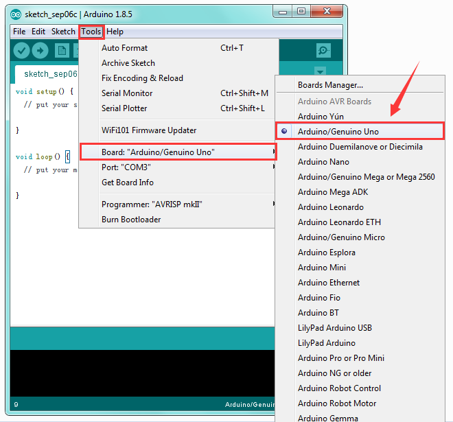

**KD0006 Kidsbits Coding Box For STEM EDU**

**(Blue and Eco-friendly)**

# Description

When doing DIY experiments, you might often connect the control board and each
sensor module using a bunch of breadboard wires or jumper wires. It is really
troublesome.

Now, we specially design this kidsbits coding box, fully compatible with the
Lego building blocks.

You can mount the control box onto Lego blocks and match our kidsbits sensor
modules to complete all kinds of entertaining experiments.

The kidsbits coding box comes with EASY plug interfaces. So you are able to
connect other sensor modules using only an RJ11 cable.

You can tinker with your control board and sensor modules without worrying too
much about doing something wrong.

The box also comes with control interface with silkscreen, four LED indicators
DC power jack, USB port and so on.

**Special Note:   
**The control board is equipped with the RJ11 6P6C interface, can use with our
sensor/module with RJ11 6P6C interface.

If you have sensor/module of other brands, it is also equipped with the RJ11
6P6C interface but has different internal line sequence, can’t be used
compatibly with our control board.

# Technical Details

-   Main Chip: ATmega328P-AU

-   Operating Voltage: +5V

-   External Power: DC 7-12V

-   Interface: RJ11 6P6C

# Silk-screen and LED Indication

-   **RESET**: reset button

-   **USB**: square USB port（for powering the board or uploading the program）

-   **DC**: external power jack（DC 7-12V）

-   Actually, each interface of control board is a 6Pin interface. You can check
    out the specific IO ports according to the silkscreen.  
    **( G**: GND **V**: VCC（5V） **NC**: no wiring**)**

Look at the surface silk-screen of kidsbits coding box and we have figured out
the pins interface as follows:

-   **The corresponding RJ11 6P6C interface of A0, A1, A6, A7 is showed below:**

-   **The corresponding RJ11 6P6C interface of D2/A2/A3 is showed below:**

-   **The corresponding RJ11 6P6C interface of I2C communication connector is
    showed below:**

(**A4:** SDA **A5:** SCL)

-   **The corresponding RJ11 6P6C interface of COM serial communication
    connector is showed below:**

(**D1:** TX **D0:** RX )

-   **The corresponding RJ11 6P6C interface of SPI communication connector is
    showed below:**

(**D10:** SS **D11:** MOSI **D12:** MISO **D13:** SCK)

-   **The corresponding RJ11 6P6C interface of D3/D4 connector is showed
    below:**

-   **The corresponding RJ11 6P6C interface of D5** **D6 D7 connector is showed
    below:**

-   **The corresponding RJ11 6P6C interface of D8/D9 connector is showed
    below:**

-   **The corresponding Pin header with pitch 2.54mm of D8/D9 connector is
    showed below:**

-   **Four LED indicators**（from left to right）

-   Yellow LED: serial communication signal sending indicator

-   Yellow LED: serial communication signal receiving indicator

-   Green LED: D13 indicator

-   Red LED: power indicator

# Use Method

## 4.1 Installing the Driver

The USB to serial port chip of the control board is **CH340G**. So you need to
install the driver for the chip. You can click the link below to download the
driver file.

<https://drive.google.com/drive/folders/1ssALY3RCks_VnWJJ-TuBczs28s2gimEI>

In different systems, the driver installation is similar. Here we start to
install the driver on the Win7 system.

Plug one end of your USB cable into the control board and the other into a USB
socket on your computer.

When you connect the control board to your computer at the first time, right
click your “Computer” —\>for “Properties”—\> click the “Device manager”, under
Other devices, you should see the “USB2.0-Serial”.

Then right-click on the USB2.0-Serial and select the top menu option (Update
Driver Software...) shown as the figure below.

Then it will be prompted to either “Search Automatically for updated driver
software” or “Browse my computer for driver software”. Shown as below.

In this page, select “Browse my computer for driver software”.

After that, select the option to browse and navigate to the “drivers” folder of
usb-ch341 installation.

Once the software has been installed, you will get a confirmation message.
Installation completed, click “Close”.
<http://wiki.keyestudio.com/index.php/File:Driver_6.png>

Up to now, the driver is installed well. Then you can right click “Computer”
—\>“Properties”—\>“Device manager”, you should see the device as the figure
shown below.

Here you can check out the Port COM21.

If you want to modify the COM Port. Follow the methods below.

-   Right click the USB-SERIAL CH340 (COM21), then select **Properties**.

-   Pop up the following window, click **Port Settings** and **Advanced**.

-   Then you can choose any COM ports as you like.

Here we select COM6, and click OK.

It will pop up the prompt window. Click **Yes**.

-   Continue to click **OK**.

-   Now, set well the COM6. Shown below.

## 4.2 Example Use of ARDUINO IDE

**STEP 1: Open Arduino**

In the previous, we have introduced the driver installation of control board. So
let’s first have basic understanding of the development environment of ARDUINO.

You can download all the Arduino IDE version from the link below:

[https://www.arduino.cc/en/Main/OldSoftwareReleases\#1.5.x](https://www.arduino.cc/en/Main/OldSoftwareReleases#1.5.x)

After that, you will learn how to upload the program to Arduino board.

First of all, open the unzipped folder of ARDUINO development software and click
icon of ARDUINO to open the software, as the figure shown below.

**STEP 2: Build Projects**

When open the Arduino software, you will have two options as below:

-   Build a new project

-   Open an exiting project example

If you want to build a new project, please select “File”→then click “New”, you
will see the software interface as follows.

### 

If you want to open an example project, please select
*File→Example→Basics→Blink*. Shown below.

**STEP 3: Select Arduino Board**

On the Arduino software, you should click *Tools→Board* , select the correct
board. Here in our tutorial we should select Arduino Uno. Shown as below.

****

**STEP 4: Select Serial Port**

If you are not sure which port is correct, at first directly open the Control
Panel of your computer, then click to open *Device Manager*, you can check the
COM port here. Shown as below.

Then you should click *Tools→Serial Port*.

**STEP 5: Upload the Code to Your Board**

Before showing you how to upload the code to your board, you can check the
function of each icon on the Tool bar of Arduino IDE listed below:

| ****  **Verify/Compile** | Check the code for errors                           |
|-------------------------------------------------------------------------|-----------------------------------------------------|
| ****  **Upload**         | Upload the current Sketch to the Arduino            |
| **** **New**             | Create a new blank Sketch                           |
| **** **Open**            | Show a list of Sketches                             |
| **** **Save**            | Save the current Sketch                             |
| **** **Serial Monitor**  | Display the serial data being sent from the Arduino |
